**Смарт-контракт** --- это децентрализованное приложение, которое
выполняет бизнес-логику в ответ на события. Выполнение смарт-контракта
может привести к обмену деньгами, предоставлению услуг, разблокировке
контента, защищенного управлением цифровыми правами, или другим видам
манипулирования данными, например изменению имени в праве собственности
на землю. Смарт-контракты также можно использовать для обеспечения
защиты конфиденциальности, например, облегчая выборочный выпуск данных,
защищенных конфиденциальностью, для удовлетворения конкретного запроса.

# MainContract.sol

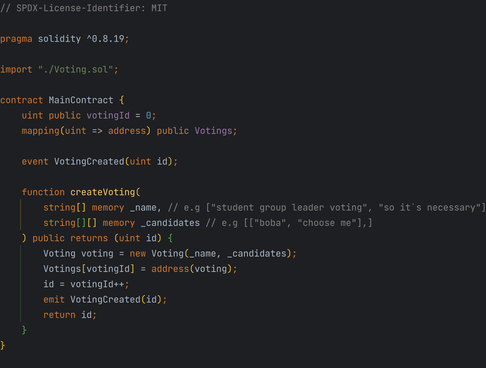{width="7.479330708661418in"
height="5.666666666666667in"}

1.  Создание контрактов на голосование: **createVoting** функция
    > позволяет создавать новые контракты на голосование. Он принимает
    > имена процессов голосования и кандидатов для каждого процесса в
    > качестве параметров и создает новый экземпляр контракта,
    > **Voting** используя предоставленную информацию.

2.  Отслеживание контрактов на голосование: сопоставление **Votings**
    > используется для отслеживания всех контрактов на голосование,
    > созданных основным контрактом. Сопоставление сопоставляет
    > идентификатор выборов с адресом соответствующего контракта на
    > голосование.

3.  Эмиссия события: контракт генерирует **VotingCreated** событие
    > всякий раз, когда создается новый контракт с голосованием. Это
    > событие предоставляет идентификатор созданного контракта на
    > голосование.

# Voting.sol

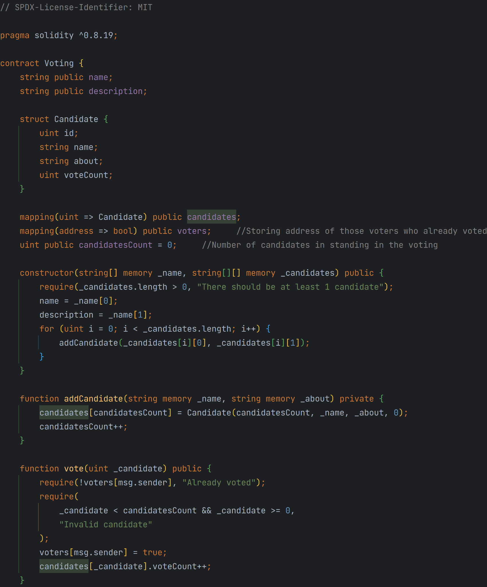{width="7.479330708661418in"
height="9.01388888888889in"}

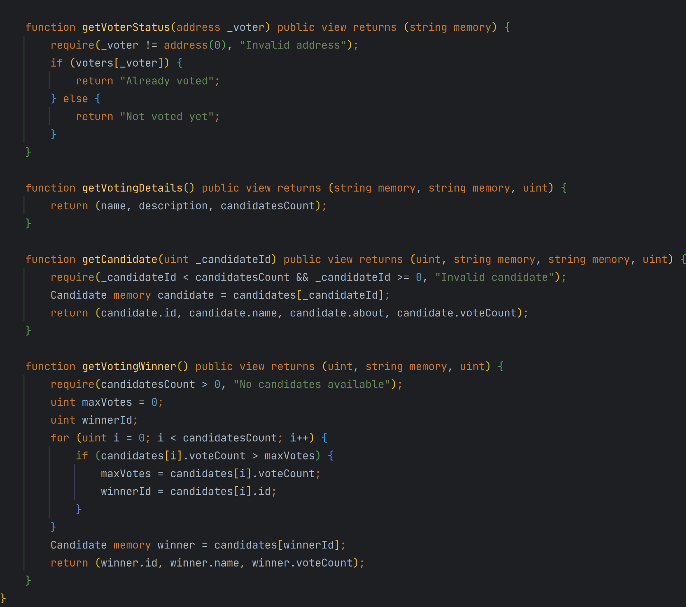{width="7.479330708661418in" height="6.625in"}

# Деплой

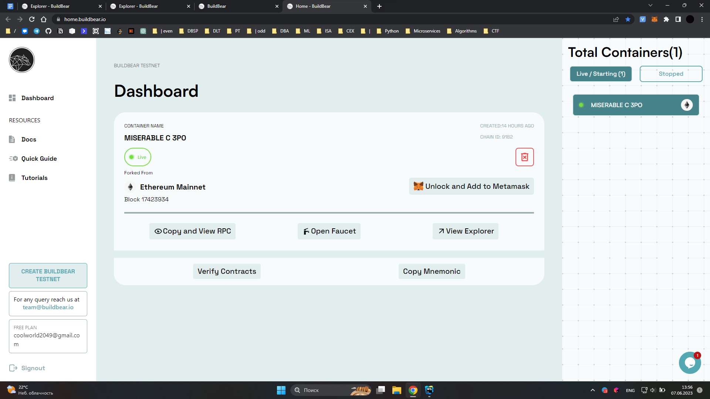{width="6.694841426071741in"
height="3.76701334208224in"}

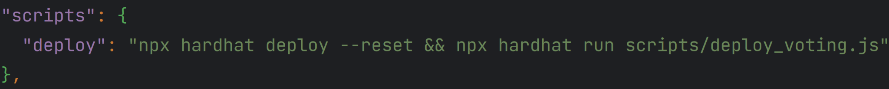{width="6.705258092738408in"
height="0.678895450568679in"}

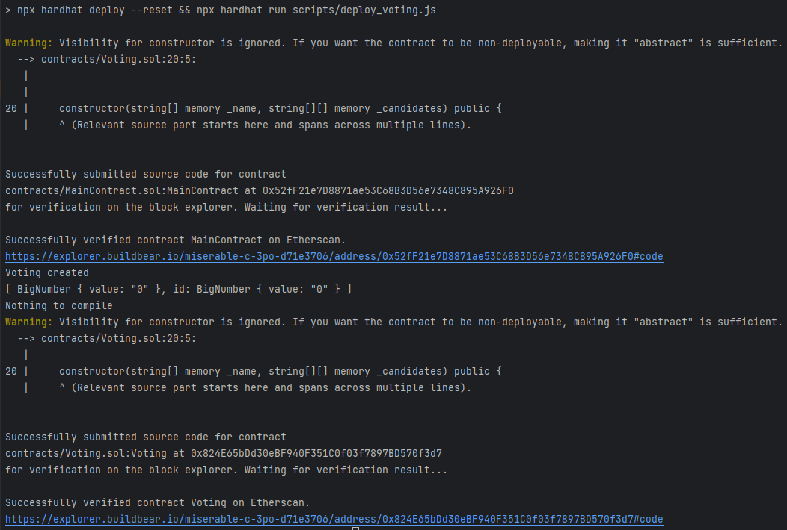{width="6.694841426071741in"
height="4.505412292213474in"}

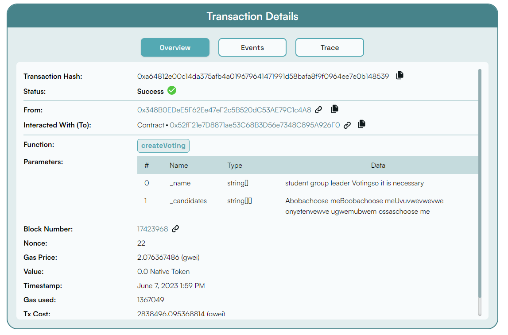{width="7.479330708661418in"
height="4.930555555555555in"}

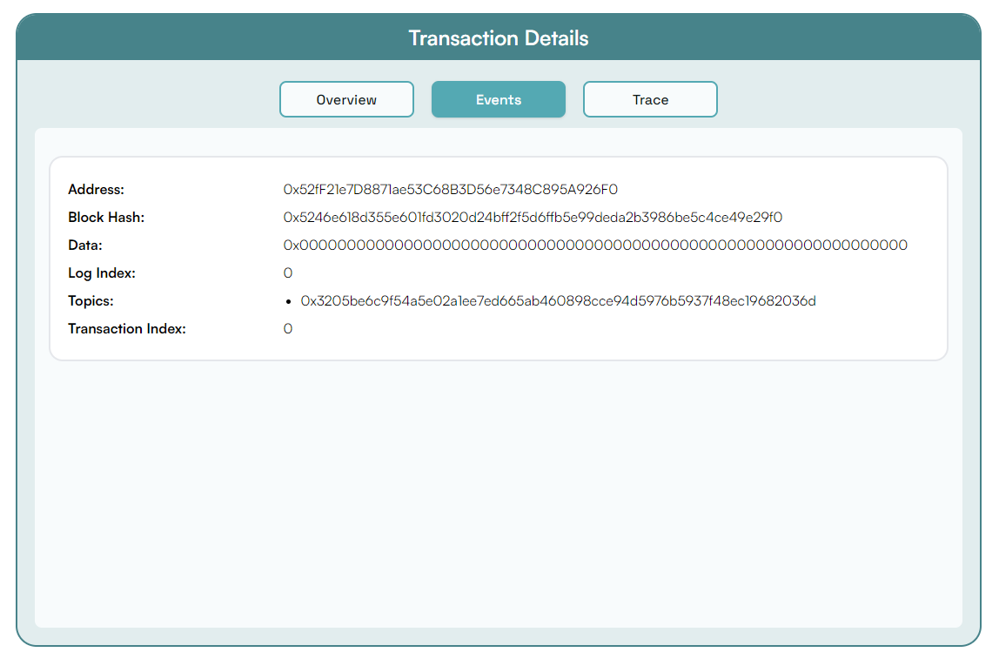{width="7.479330708661418in"
height="4.930555555555555in"}

# Тестирование

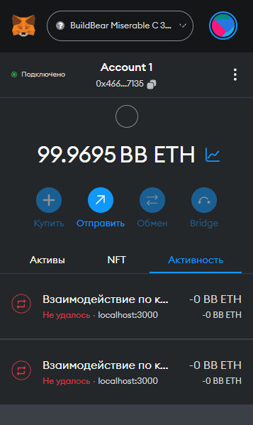{width="2.4541776027996502in"
height="4.117794181977253in"}

### Contract: MainContract (0x52fF21e7D8871ae53C68B3D56e7348C895A926F0)

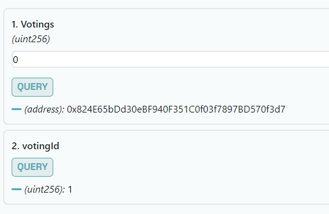{width="5.604166666666667in"
height="3.6458333333333335in"}

### Contract: Voting (0x824E65bDd30eBF940F351C0f03f7897BD570f3d7)

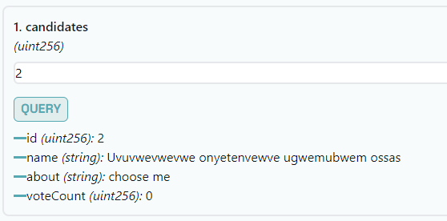{width="5.8125in" height="2.875in"}

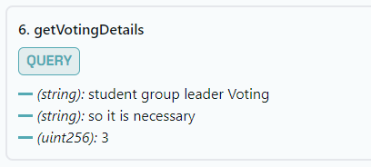{width="4.25in" height="1.9166666666666667in"}

голосование за Uvuvwevwevwe onyetenvewve ugwemubwem ossas

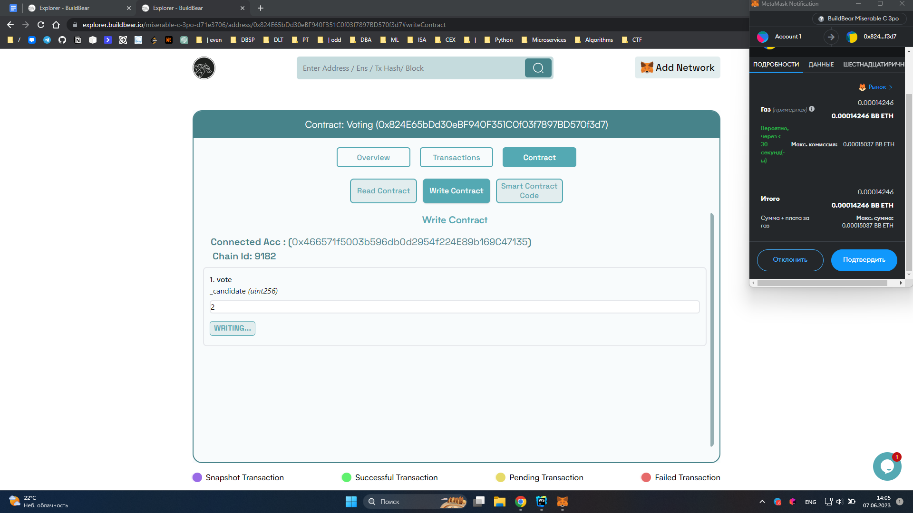{width="7.479330708661418in"
height="4.208333333333333in"}

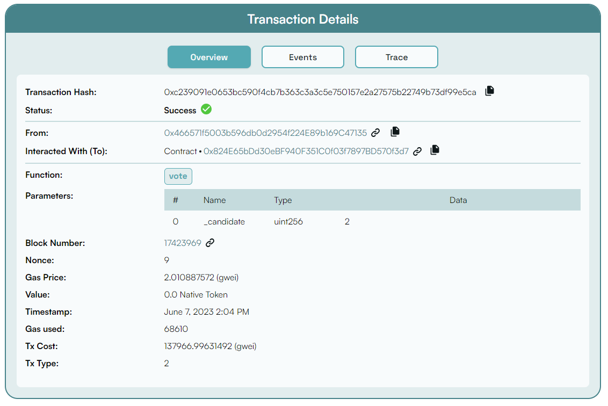{width="7.479330708661418in" height="5.0in"}

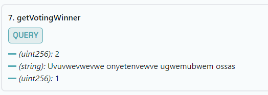{width="5.345882545931759in" height="1.9375in"}

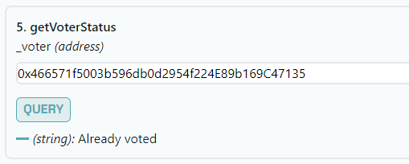{width="5.302083333333333in" height="2.125in"}

попытка еще раз проголосовать за 2 номер

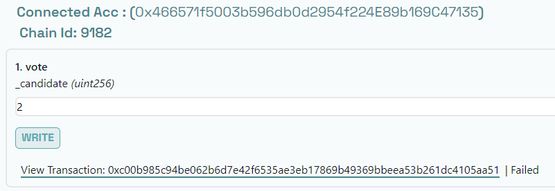{width="7.479330708661418in"
height="2.5833333333333335in"}

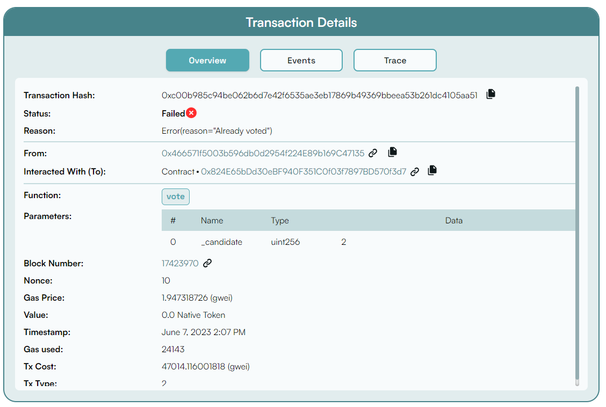{width="7.479330708661418in"
height="5.027777777777778in"}
